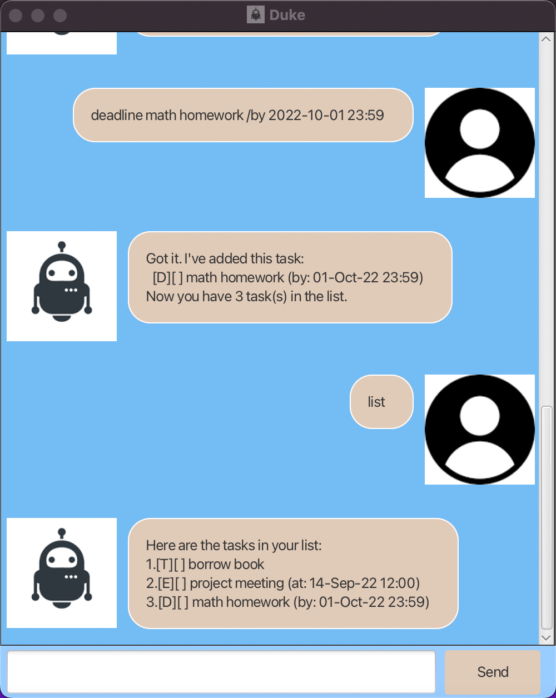

# Duke User Guide

Duke is a **desktop task management app optimized for use via a Command Line 
Interface (CLI)** while still having the benefits of a Graphical User Interface 
(GUI). 

If you can type fast, Duke can manage your tasks faster than traditional
GUI apps!

### Quick Start
1. Ensure you have `Java 11` or above installed in your Computer.
2. Download the latest `duke.jar` from [here](https://github.com/Ugholaf/ip/releases).
3. Copy the file to the folder you want to use as the home folder for your Duke application.
4. Double-click the file to start the app. The GUI similar to the below should appear in a few seconds.
   
5. Type the command at the bottom and press Send to execute it.
6. Refer to the [Usage](#usage) below for details of each command.

## Features 

### Task Management
Duke helps to manage 3 types of tasks:
- **ToDos**: Tasks without any datetime attached to it
- **Deadline**: Tasks that need to be done before a specific datetime
- **Event**: Tasks that start at a specific time and ends at a specific time

It is supported by the following operations:
- Show a list of tasks
- Add tasks
- Delete tasks
- Mark tasks as done/undone
- Find tasks

### Autosave
The tasks will be saved to the hard disk automatically whenever the data changes.

## Usage

Notes about the command format:
- Words in `UPPER_CASE` are the parameters to be supplied by the user.
- Some commands have a shorter aliases for keywords. The format below will show both keywords for the same command. 
  
   e.g. Both `list` and `l` will display a list of the current tasks. 


### `list` - List all tasks

Display a list of current tasks in Duke

Format: `list` or `l`
- Extraneous parameters will result in list command not being recognized.

  e.g. if the command specifies `list 123`, Duke will not understand this command and return an error message.


Example of usage: 

`list`

`l`

Expected outcome:
- Display all current tasks.

```
Here are the tasks in your list:
1.[T][] borrow book
2.[E][] project meeting (at: 14-Sep-22 12:00)
3.[D][] math homework (by: 01-Oct-22 23:59)
```

### `todo` - Add a new ToDo

Creates a new ToDo and saves to hard disk.

Format: `todo DESCRIPTION` or `t DESCRIPTION`

Example of usage:

`todo borrow book`

`t borrow book`

Expected outcome:

```
Got it. I've added this task:
 [T][] borrow book
Now you have 4 task(s) in the list.
```


### `deadline` - Add a new Deadline

Creates a new Deadline and saves to hard disk. 

Format: `deadline DESCRIPTION /by YYYY-MM-DD HH:MM` or `d DESCRIPTION /by YYYY-MM-DD HH:MM`

Example of usage:

`deadline math homework /by 2022-11-01 23:59`

`d math homework /by 2022-11-01 23:59`

Expected outcome:

```
Got it. I've added this task:
 [D][] math homework (by: 01-Nov-22 23:59)
Now you have 4 task(s) in the list.
```


### `event` - Add a new Event

Creates a new Deadline and saves to hard disk.

Format: `event DESCRIPTION /at YYYY-MM-DD HH:MM` or `e DESCRIPTION /at YYYY-MM-DD HH:MM`

Example of usage:

`event project meeting /at 2022-11-01 23:59`

`e project meeting /at 2022-11-01 23:59`

Expected outcome:

```
Got it. I've added this task:
 [E][] project meeting (by: 01-Nov-22 23:59)
Now you have 4 task(s) in the list.
```

### `delete` - delete task

Deletes a task from the current list if the index is valid

Format: `delete INDEX` or `del INDEX`
- `INDEX` refers to the position of the task in the list

Example of usage:

`delete 2`

`del 2`

Expected outcome:
- Deletes the second task in the list. 
- Assuming the second task is a Todo task borrow book.
```
Noted. I've removed this task:
 [T][] borrow book
Now you have 4 task(s) in the list.
```

### `mark` - mark task as done

Marks a task as done from the current list if the index is valid

Format: `mark INDEX` or `m INDEX`
- `INDEX` refers to the position of the task in the list

Example of usage:

`mark 2`

`m 2`

Expected outcome:
- Marks the second task in the list as done.
- Assuming the second task is a Todo task borrow book.
```
Nice! I've marked this as done:
 [T][X] borrow book
```


### `unmark` - mark task as undone

Marks a task as undone from the current list if the index is valid

Format: `unmark INDEX` or `u INDEX`
- `INDEX` refers to the position of the task in the list

Example of usage:

`unmark 2`

`u 2`

Expected outcome:
- Marks the second task in the list as undone.
- Assuming the second task is a Todo task borrow book.
```
Ok, I've marked this task as not done yet:
 [T][] borrow book
```


### `find` - find tasks by description

Displays a list of tasks that matches the given query

Format: `find QUERY` or `f QUERY`

Example of usage:

`find meeting`

`f meeting`

Expected outcome:
- Displays a list of tasks with their descriptions containing the word "meeting".
```
Here are the matching tasks in your list:
1.[E][] project meeting (at: 14-Sep-22 12:00)
```

### `bye` - Exit Duke

Exits and closes the Duke application after 1 second.

Format: `bye`

